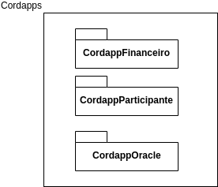
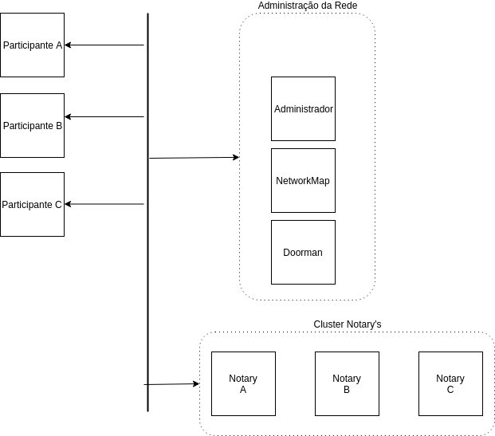
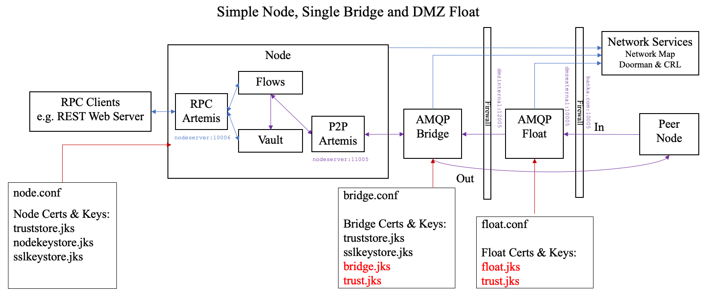

## BlockChain 

###Questões DLT

1. Você é o responsável por definir qual tecnologia de DLT será utilizada para a criação de
uma rede permissionada. As únicas opões possíveis dadas as características e diretrizes
da empresa em que trabalha são R3/Corda Enterprise e Hyperledger Fabric. Com isso
em mente, que critérios (técnicos, de mercado, etc.) você utilizaria para balizar a sua
decisão entre uma ou outra? Explique os critérios.

  Para uma solução financeira vide que o solicitante em questão é a B3, uma empresa que atua no alicerce da estrutura de
capitais do Brasil, minha opção seria  pela utilização do **[Corda Enterprise](https://www.r3.com/platform/)**, pois está 
plataforma foi idealizada e concebida para sistemas financeiros de um modo geral.
 Segundo um [estudo](http://www.dtcc.com/news/2018/october/16/dtcc-unveils-groundbreaking-study-on-dlt) publicado pela  Depository Trust & Clearing Corporation (DTCC) 
que você poderá obter mais informações [aqui](https://medium.com/corda/throughput-a-corda-story-1bc2cb9b2b60), 
O Corda é escalável o suficiente para suportar os volumes diários do mercado acionário dos EUA, por se tratar do maior
mercado acionário do mundo, seria o suficiente para sua utilização no Brasil.
 O Hyperldger-fabric por ser mais genérico de uma forma geral, não encontrariamos estruturas internas como [financial](https://docs.corda.net/financial-model.html) e [Token](https://www.corda.net/blog/announcing-the-corda-token-sdk-1-0/)  Corda,
 que nós entrega uma estrutura que já seria um ótimo ponto de partida para o desenvolvimento de um [CordaApp](https://docs.corda.net/cordapp-overview.html) financeiro, 
gastando assim mais energia na soluções e regras de negócio. 
 Um outra observação é o fato que Hyper-ledger Fabric  não existe suporte para empresas como o Corda, sendo assim quaisquer problema interno ficara muito difícil 
 de buscar uma ajuda direta.
    
2. Explique quais são, na sua visão, os maiores desafios na implementação de uma rede
permissionada de DLT?

  Para implementação de uma rede Corda é necessário que exista uma entidade que administre a rede Corda, pois existe 
alguns papeis da rede como o [Networkmap](https://docs.corda.net/network-map.html) e o [Doorman](https://docs.corda.net/api-identity.html?highlight=doorman), que são vitais para a saúde da rede Corda. Esta Entidade a
ser criada deveria administrar de forma autônoma por se tratar de um DLT todos os participantes devem compartilhar esta
responsabilidade, já sobre o Doorman existe a regulamentação no Brasil que você pode obter mais informações [aqui](https://www.iti.gov.br/acesso-a-informacao/41-lei-de-acesso-a-informacao/perguntas-frequentes/112-sobre-certificacao-digital)
no qual o Corda atualmente não tem suporte paras extensões que existe no certificado X509 utilizados pela ICP-Brasil,
para este problema deveremos realizar solicitações tanto para R3 quanto para ICP-Brasil, pois adequação desta diretrizes
nós dará segurança jurídica, um
  outro desafio é difundir o conceito de que soluções deste tipo podem ser desenvolvidas em conjunto, para que o custos
e beneficios sejam colhidos juntos, não onerando apenas alguns participantes.
  
3. Você recebeu uma nova demanda de projeto com a lista de requisitos abaixo:
    
a. Conhecer e autorizar quem são os participantes da rede.
    
    No Ambiente Corda isso tudo já está integrado, mas deve exister a criação de um Administrador
    que facilitará à administração do sistema.    
        
    
b. Atender a um volume de operações na ordem de grandeza de 2500 transações
por segundo.
    
    Como relatei na primeira questão existe um estudo no qual afirmar que suporta um grande número 
    de transações, porém até o presente momento não encontrei um documento técnico revelando como
    foi a contrução desta rede.

c. Ter privacidade nos dados transacionados e armazenados, de forma que
somente os participantes que podem ver os dados da transação de fato
enxerguem e tenham acesso a esses dados.

    Está questão é nativa do Corda, pois diferentimente das outras plataformas a transação é a realizada
    por Membros que tenham um pré conhecimento do outro.
    
d. Um Oracle ou outro tipo de fontes de dados externa irá incrementar as
transações com um índice de preço.
    
    No Corda temos este papel  como você poderá obter mais informações [aqui](https://docs.corda.net/key-concepts-oracles.html),
    só que este papel na rede deve ficar a cargo do Administrador da rede, ou ele deve realizar um
    cadastro para quem desejar fazer este papel.   

e. Aplicações legadas precisam ler o ledger e interagir com a rede fazendo novas
transações ou atualizações.

    Deve-se construir uma web-api para este serviço
    
f. Uma tela de acompanhamento do que está rodando no Ledger precisa ser
construída.
    
    Após a construção web-api deveremos ter uma namespace, e construir uma aplicação web front,
    para consultar essas url

Desenhe e explique a arquitetura da solução considerando:
    
   a. Escolher e justificar a tecnologia entre R3/Corda Enterprise e Hyperledger
Fabric.
    
        
   b. Desenho do smart contract (Cordapp ou Chaincode).
    
   c. Desenho lógico da solução: camadas da tecnologia DLT (exemplo:
ordenação/notarização, autorização, certificação etc.), mecanismos de
integração entre os módulos e entre o Oracle e a aplicação.

d. Desenho de infraestrutura: como as camadas da tecnologia estão inseridas
numa infraestrutura corporativa incluindo firewalls, balanceadores,
datacenters etc.

e. Sizing do ambiente (quantidade de servidores e equipamentos necessários).

f. Desenho do modelo de alta disponibilidade da solução.

g. Custo aproximado da solução (pode ser baseado em informações de preços de
clouds publicas como Azure, AWS ou Google).

###Esta imagem representa um nó da rede, podendo ele ser um participante. Todos os nós vão ter esta característica 

Corda:
    Contém os cordapps eo o framework Corda

Server Api:
    Este server contém a comunicação com Rpc Corda, criando se assim
uma Api Rest.

Corda UI: Responsável  pelo site de consulta

Obs:
    Eu escolhi utilizar o Azurre Microsoft, por ser mais fácil a sua configuração.

###Cordapps

  
  
  Todos os nós da rede a ser criada deverão conter esses três Cordapps.
  
  CordappFinanceiro : O Básico para implementação de futuros Cordapps da rede
  
  CordappParticipante: Este Cordapp será vital para o controle dos nós na rede, fazendo a integração direto com o nó Administrador da Rede
  
  CordappOracle: Como existirá o cordappParticipnate, todas as suas configurações estarão no Administrador  
  

###Rede Simplificada

Aqui cada participante representa um nó de rede, mas aqui temos um bem especifico que seria o nó Administrador.

Adminitrador:
   Neste nó ele vai conter uma estrutura de Administração de toda a rede e será o nó Oracle para está aplicação.
    
NetworkMap:
    Será uma maquina especifica de alta disponibilidade para este gerenciamento.
    
Doorman:
    Idem networkmap.
    
Cluster Notary's:
    Pelo grande número de transações será necessário a criação de um cluster de Notary, pois aqui pode existir um gargalo

A imagem a segui demonstra como deve ficar o corda com firewall 

O Custo estimado utilizando o Azurre para cada maquina 

 
 

##Referências

https://medium.com/corda/transactions-per-second-tps-de3fb55d60e3

https://docs.corda.r3.com/sizing-and-performance.html

https://docs.corda.r3.com/performance-testing/introduction.html

https://medium.com/corda/transactions-per-second-tps-de3fb55d60e3

http://www.dtcc.com/news/2018/october/16/dtcc-unveils-groundbreaking-study-on-dlt
 

https://hyperledger-fabric.readthedocs.io/en/release-1.4/